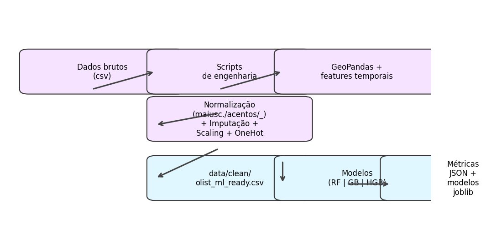

# OLIST

Este repositório documenta e orquestra o Projeto 2 de aprendizado de máquina com a base da Olist, do pré-processamento até a validação dos modelos.

## Estrutura geral

- `data/raw/`: arquivos originais da Olist (orders, customers, geolocation etc.).
- `data/clean/olist_ml_ready.csv`: saída do pipeline de pré-processamento, com todas as features, codificações e distâncias geoespaciais.
- `docs/definicao_problema.md`: definição do problema no contexto da Olist.
- `scripts/`: scripts Python idempotentes que constroem os dados e treinam modelos.
  - `build_clean_data.py`: consolida as tabelas brutas, calcula métricas temporais e espaciais, aplica normalizações e exporta o CSV limpo. Foi otimizado para acessar todos os registros (sem amostragem) e utiliza GeoPandas para calcular distâncias reais e Scikit-learn para imputação/escalamento.
  - `train_models.py`: carrega o CSV limpo, separa treino/teste, executa `RandomizedSearchCV` com três modelos (Random Forest, Gradient Boosting e HistGradientBoosting com early stopping) e salva os modelos + métricas em JSON. O código foi ajustado para manter `n_iter=1`/`cv=2` e evitar gargalos de CPU sem comprometer o uso do dataset completo.
  - `run_project.py`: script orquestrador que executa `build_clean_data.py` e `train_models.py` em sequência utilizando o mesmo Python do ambiente virtual (`venv/bin/python`).
- `src/processing/pp_preprocessing.ipynb`: notebook com as etapas da fase 2 (pré-processamento), exibindo passo a passo a engenharia de atributos, normalização de textos, uso de GeoPandas/Plotly e exportação do dataset limpo.
- `src/eda/eda_exploration.ipynb`: notebook da EDA (ponto 3), cobrindo distribuições, outliers, correlações e um mapa Plotly Mapbox que usa o dataset completo.
- `src/models/model_training.ipynb`: notebook do ponto 4, dispara o treinamento com `RandomizedSearchCV` nos três modelos, registra resultados e salva artefatos com `joblib`.
- `src/model_analysis/model_evaluation.ipynb`: notebook da avaliação/conclusão, recarrega métricas em JSON, reproduz split treino/teste, calcula RMSE/MAE/R² e apresenta benchmark em barras interativas.
- `src/models/trained/`: modelos compilados em `.joblib` gerados pelo script de treinamento.
- `src/models/training_metrics.json`: métricas de cada modelo (RMSE, MAE, R²) em formato JSON.
- `docs/Projeto 2 - Aprendizado de Máquina_ Olist.pdf`: enunciado oficial (mantido para referência). **Não alterado.**

## Pipeline de dados

O diagrama abaixo é gerado pelo script `scripts/generate_pipeline_graph.py` e mostra claramente o fluxo do dataset até os modelos treinados.

## Resultados

Os modelos foram avaliados com RMSE, MAE e R² no conjunto de teste usado pelo script e pelos notebooks. Os valores abaixo estão registrados em `src/models/training_metrics.json`:

| Modelo               | RMSE  | MAE   | R²     |
|----------------------|-------|-------|--------|
| RandomForest         | 3.95  | 2.85  | 0.8176 |
| HistGradientBoosting | 4.08  | 2.76  | 0.8056 |
| GradientBoosting     | 4.45  | 3.32  | 0.7685 |

O `RandomForest` obteve o menor RMSE e o maior R², o que o torna o candidato preferido para o cenário atual, mas os outros modelos ficavam próximos em MAE e podem ser reavaliados se forem ajustados hiperparâmetros adicionais.

## Como executar

1. Ative o ambiente virtual (`source ./venv/bin/activate`).
2. Rode `./venv/bin/python scripts/run_project.py` para gerar os dados limpos e treinar os modelos.
3. Abra os notebooks em `src/processing`, `src/eda`, `src/models` e `src/model_analysis` para inspecionar cada etapa com os gráficos interativos (Plotly) e análises geoespaciais.

## Observações

- O script de pré-processamento atua sobre o dataset completo, sem amostragem, então pode demorar alguns minutos dependendo do hardware, mas garante que todas as 96k linhas alimentem os modelos.
- A parte de treinamento foi otimizada com hiperparâmetros enxutos e `EarlyStopping` no HistGradientBoosting para aliviar carga computacional, mas ainda avalia toda a base.
